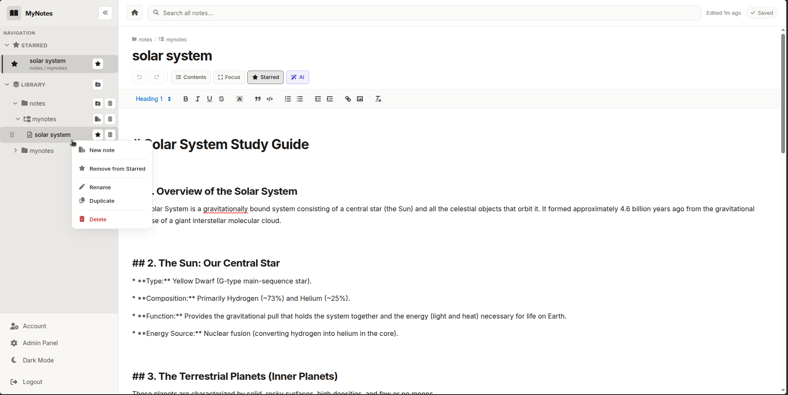
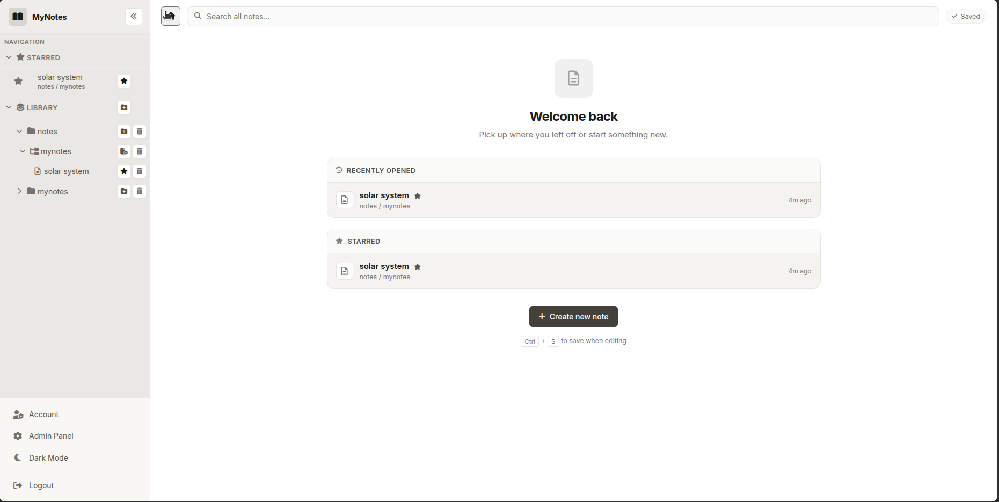
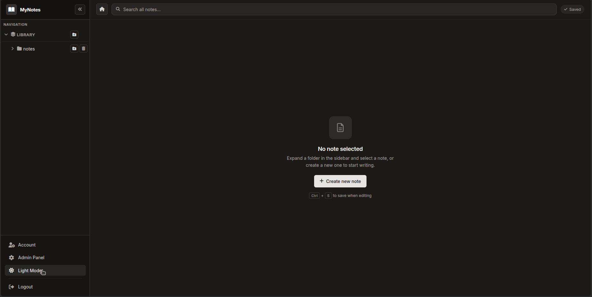
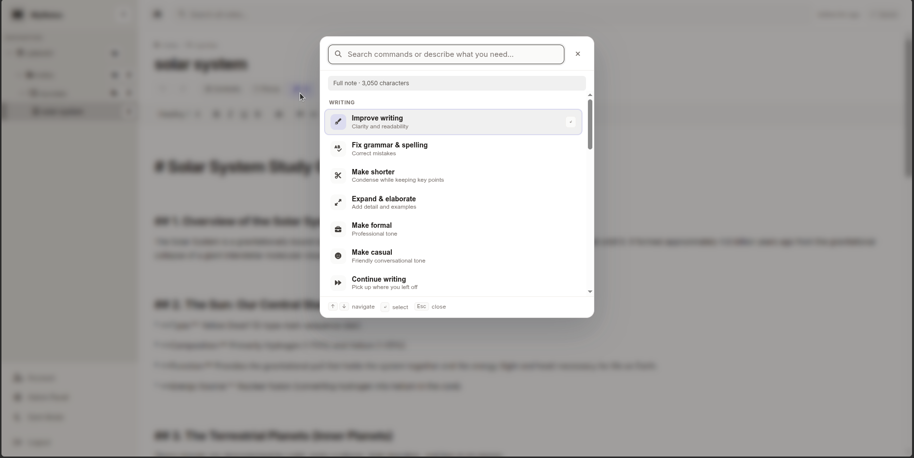
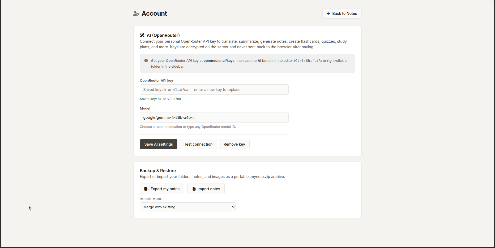
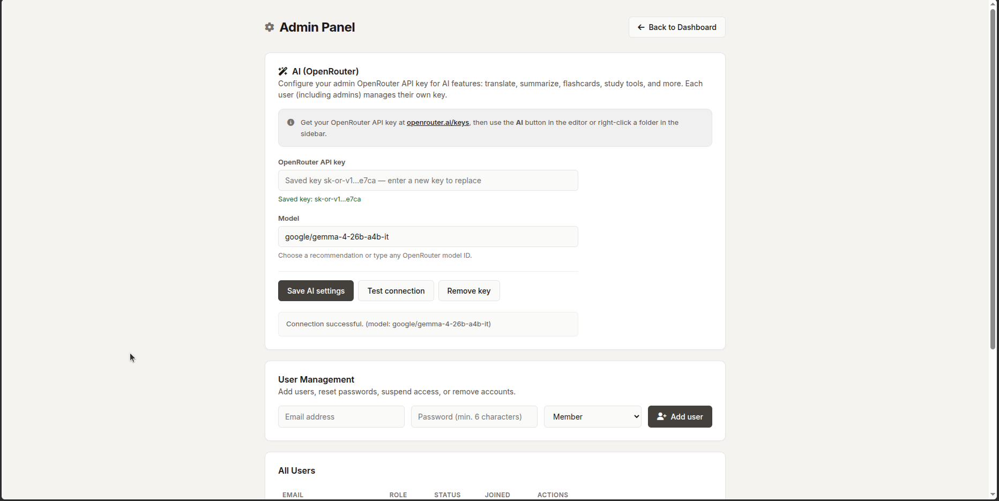
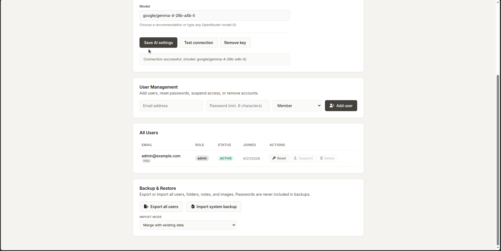

# MyNote

Self-hosted note-taking web app with a folder-style hierarchy, rich text editing, sketch drawing, search, image uploads, optional AI assistance, and multi-user support. Runs on shared hosting (cPanel) or locally with PHP and MySQL.

The UI is branded **MyNotes**; the repository and deployment docs use **MyNote**.



## Screenshots

### Home dashboard

Welcome screen with recently opened notes, starred notes, and a quick way to create a new note. Open it with the home button in the top bar.



### Editor

Rich text editing with breadcrumb navigation, table of contents, focus mode, a **Draw** button for sketches, and a **Star** button in the toolbar (next to AI) to add or remove notes from Starred.


### Dark mode

Light and dark themes with the same layout and features.



### AI assistant

Command palette for writing help: improve clarity, fix grammar, shorten or expand text, change tone, continue writing, and more. Structured AI output (headings, lists, emphasis) is converted from Markdown into rich text when inserted. Open with the AI button or `Ctrl+Shift+A`.



### Account settings

Personal OpenRouter API key, model selection, and per-user backup export/import.



### Admin panel

User management, system-wide backup, and admin AI configuration.





## Features

- **Hierarchy** — Organize notes in notebooks, sections, and pages with drag-and-drop reordering
- **Home dashboard** — Recently opened notes, starred notes, and one-click create when no note is open
- **Rich text editor** — Write and format notes with [Quill](https://quilljs.com/)
- **Sketch drawing** — Draw directly in notes from the editor toolbar (**Draw** or `Ctrl+Shift+D`): pen, highlighter, lines, arrows, shapes, text, and eraser; numeric brush/text size; 18-color palette plus custom color picker; resizable canvas; optional crop-to-drawing on insert (PNG uploaded like pasted images)
- **Search** — Full-text search across all of your notes
- **Images** — Upload images to notes; OCR text is stored for search
- **Image Resizing & Float Alignment** — Drag corner handles to scale images proportionally with aspect-ratio lock; float left/right (with text wrapping), center, or reset to default from a floating layout toolbar (auto-constrained within margins to prevent clipping)
- **Dynamic Font Manager & Offline Cache** — Install/delete any Google Font dynamically by name in Settings; download and cache all active font variants (`.woff2`) locally to the server for 100% offline note-taking without external CDN requests
- **Starred notes** — Star a note from the editor toolbar (next to AI) or from the sidebar; starred notes appear in a dedicated sidebar section and on Home
- **Table of contents** — Auto-generated from headings inside the current note
- **Focus mode** — Hide the sidebar and other chrome to focus on writing
- **Note breadcrumb** — See the notebook and section path above the title
- **Editor stats** — Word count, character count, and estimated read time in the footer
- **Collapsible sidebar** — Collapse the tree for more editor space
- **Themes** — Light and dark mode
- **Multi-user** — Admin and member roles; admins manage users from the admin panel
- **AI (optional)** — Connect your own [OpenRouter](https://openrouter.ai/) API key to translate, summarize, generate content, create flashcards, quizzes, study plans, and more
- **Structured AI output** — AI responses that use Markdown (headings, lists, bold, links, blockquotes) are automatically converted to rich text in the editor instead of plain paragraphs
- **Backup** — Export and import your data as a portable `.mynote.zip` archive
- **Security** — Session-based auth, CSRF protection, login rate limiting, encrypted AI keys on the server

## Requirements

- **PHP 8.0+** (8.1 or 8.2 recommended)
- **MySQL or MariaDB**
- PHP extensions: `pdo_mysql`, `openssl`, `zip` (backup export/import), `fileinfo` (upload validation)

## Quick start (local development)

On a Linux machine with PHP, MySQL, and `sudo` access:

```bash
git clone https://github.com/ClaudiuJitea/MyNote.git
cd MyNote
./setup_local.sh
php -S localhost:8000
```

Open [http://localhost:8000](http://localhost:8000). The setup script prints the generated admin email and password.

Environment variables (optional):

| Variable       | Default            | Description              |
|----------------|--------------------|--------------------------|
| `DB_NAME`      | `mynote_local`     | MySQL database name      |
| `DB_USER`      | `mynote_local`     | MySQL user               |
| `DB_PASS`      | (random)           | MySQL password           |
| `ADMIN_EMAIL`  | `admin@example.com` | Initial admin email     |
| `ADMIN_PASS`   | (random)           | Initial admin password   |

### Manual local setup

1. Copy `api/config.example.php` to `api/config.local.php` and fill in database credentials and a long random `app_secret`.
2. Create the database and tables (see [DEPLOY.md](DEPLOY.md) Step 3 for the SQL schema).
3. Create an admin user:

   ```bash
   php scripts/setup_admin_cli.php admin@example.com 'your-secure-password'
   ```

4. Ensure writable directories exist:

   ```bash
   mkdir -p uploads data/rate_limits
   chmod 775 uploads
   chmod 700 data data/rate_limits
   ```

5. Start the built-in PHP server:

   ```bash
   php -S localhost:8000
   ```

## Production deployment

For shared hosting with cPanel (upload, database, permissions, first admin user, troubleshooting), see **[DEPLOY.md](DEPLOY.md)**.

## Configuration

All secrets live in `api/config.local.php`, which is gitignored and must not be committed:

```php
<?php
return [
    'db_host' => 'localhost',
    'db_name' => 'your_db_name',
    'db_user' => 'your_db_user',
    'db_pass' => 'your_db_password',
    'app_secret' => 'generate-a-long-random-string-at-least-32-chars',
];
```

Copy from [`api/config.example.php`](api/config.example.php) as a starting point.

## Project structure

```
MyNote/
  index.html          # App shell
  app.js              # Frontend logic
  style.css           # Styles (light/dark themes)
  api/                # PHP JSON API
    auth.php          # Login, logout, session
    notebooks.php     # Notebooks CRUD
    sections.php      # Sections CRUD
    pages.php         # Pages CRUD
    search.php        # Full-text search
    upload.php        # Image uploads
    ai.php            # OpenRouter AI actions
    export.php        # Backup export
    import.php        # Backup import
    admin.php         # User management (admin only)
    config.php        # Bootstrap, DB, security helpers
    lib/              # Shared PHP libraries
  scripts/
    setup_admin_cli.php   # CLI admin user setup
  img/                # README screenshots
  uploads/            # User-uploaded images (writable)
  data/               # Rate-limit state (writable, auto-created)
  setup_local.sh      # Local dev bootstrap script
  DEPLOY.md           # cPanel deployment guide
```

## Typography & offline fonts

Manage fonts from the **Account Settings** panel under **Typography & Offline Fonts**:
- **Add custom Google Fonts**: Enter the name of any Google Font (e.g. *Playfair Display*, *Oswald*). The server validates the font name and adds it to the active whitelist.
- **Offline Caching**: Click **Download fonts to server** to package all configured fonts locally to the server's filesystem. When active, the application runs 100% offline without querying Google CDNs.
- **Dynamic previews**: The font selector dropdown in the editor toolbar previews each font in its actual typeface layout.

## Image resizing & alignment

Click any image in the editor to activate the resize handles and toolbar:
- **Resizing**: Drag any of the four circular corner handles to scale the image proportionally.
- **Presets**: Resize instantly to standard widths (`25%`, `50%`, `100%`, or `Auto` for original).
- **Alignment**: Align center or float left/right. Floating wraps surrounding paragraph text cleanly starting from the top.
- **Layout containment**: The floating toolbar is automatically bounded horizontally within the editor borders to prevent clipping.

## AI setup & OpenRouter Integration

AI assistance features in MyNote are optional. Each user can configure their own personal key, or administrators can configure a system-wide fallback key. Without a key, the rest of the application remains fully functional.

### Step 1: Create an OpenRouter API Key
1. Go to the [OpenRouter Keys Page](https://openrouter.ai/keys) and log in.
2. Click **Create Key**, assign it a name (e.g. `MyNote`), and copy the generated key (it starts with `sk-or-v1-…`).
3. *Note:* You can use OpenRouter with a funded balance, or choose free-tier models (marked with `:free`) that require no credit card or payments.

### Step 2: Configure Your Key in MyNote
1. Log in to your MyNote application instance.
2. Click **Account** at the bottom-left of the sidebar to open user settings.
3. Locate the **AI (OpenRouter)** card.
4. Paste your API key into the **OpenRouter API key** input field.

### Step 3: Choose an AI Model
*   **Recommended (Default):** `google/gemma-4-26b-a4b-it` — pre-configured for optimal balance between speed, reasoning, and note formatting.
*   **Free Alternatives:** Type a free model ID (e.g. `google/gemma-4-26b-a4b-it:free`, `google/gemma-4-31b-it:free`, or `meta-llama/llama-3-8b-instruct:free`).
*   **Custom Models:** You can type **any** model identifier hosted on OpenRouter (e.g. `anthropic/claude-3.5-sonnet`, `meta-llama/llama-3.1-70b-instruct`) in the Model input field. A datalist will provide auto-complete suggestions.

### Step 4: Test Connection & Save
1. Click **Test connection**. The app will make a test request to OpenRouter's endpoint.
2. If successful, you will see a green success message `Connection successful.` confirming the connection.
3. Click **Save AI settings**. Keys are encrypted symmetrically on the server using AES-256-GCM and are never sent back to the browser in plain text after saving.

### Administrator Fallback Key (System-wide Setup)
Admins can set up a global fallback key so members don't need to generate their own:
1. Log in as an administrator and click **Admin Panel** in the sidebar.
2. Under the **AI System Fallback** card, enter the fallback OpenRouter key and model.
3. If user accounts do not have a personal key saved, the application automatically falls back to this administrator key.

### Using AI Actions
Select any text block in your note editor and open the AI palette:
*   **Trigger Shortcut:** Press `Ctrl+Shift+A` or click the **AI** action button in the toolbar.
*   **Writing Assistance:** Select from pre-configured actions like *Improve Clarity*, *Fix Grammar*, *Change Tone* (Professional, Casual, Confident, Friendly), *Shorten*, *Expand*, or *Summarize*.
*   **Study Tools:** Instantly generate Flashcards, Quizzes, or structured Study Plans from your selected notes text.

### Structured AI output (Markdown to rich text)

Many AI actions are prompted to return structured Markdown so inserted content keeps headings, lists, and emphasis instead of a single plain-text block. When you apply an AI result to the editor, MyNote converts that Markdown into Quill rich text automatically.

**Supported Markdown syntax:**

| Syntax | Result in the editor |
|--------|----------------------|
| `#` through `######` at line start | Heading levels 1-6 |
| `- item` or `* item` | Bulleted list |
| `1. item` | Numbered list |
| `**bold**` or `__bold__` | Bold |
| `*italic*` or `_italic_` | Italic |
| `` `code` `` | Inline code |
| `[label](url)` | Link |
| `> quote` | Blockquote |

**Actions that commonly return structured output:** Expand, Outline, Explain, Generate, Brainstorm, Quiz, Memorize, Study Plan, Summarize Section/Notebook, Ask, and Continue Writing. Grammar, Improve, Translate, and similar rewrite actions preserve existing headings and list formatting where possible.

**Apply modes:** Replace the selection, append to the end of the note, or prepend at the top. Append and prepend insert a blank paragraph before the new content when the note already has text.

If the AI returns HTML instead of Markdown, it is inserted as-is without conversion.

## Sketch drawing

Open the sketch modal from the editor toolbar (**Draw** or `Ctrl+Shift+D`) while editing a note.

| Tool | Description |
|------|-------------|
| Pen / Highlighter | Freehand drawing |
| Line / Arrow | Straight lines and arrows |
| Rectangle / Filled rectangle / Ellipse | Shape outlines and fills |
| Text | Click the canvas, type inline, press Enter to place |
| Eraser | Remove strokes |

**Brush** and **Text** size use a numeric carousel (`◀` / `▶`). Choose from preset swatches or the eyedropper for any color. Drag the canvas corner handle to resize the drawing area (within the modal). Enable **Crop to drawing** to insert only the drawn region (plus a small margin) instead of the full canvas.

Sketches are exported as PNG and embedded in the note at the cursor. Stroke data is kept in memory during editing for undo; a separate sketch note type with JSON persistence is planned for a later release.

## Backup and restore

- **Export** — Download a `.mynote.zip` archive containing your notebooks, notes, and images.
- **Import** — Restore from a previously exported archive (from Account settings).
- Admins can also export a full system backup.

Requires the PHP `zip` extension.

## Security notes

- Never commit `api/config.local.php` or real credentials.
- Rotate database passwords if they were ever exposed.
- Set `uploads/` to `755` or `775` and `data/` to `700` on production servers.
- Use HTTPS in production so session cookies and credentials are protected in transit.

## License

No license file is included in this repository. Add one if you intend to open-source or distribute the project.
